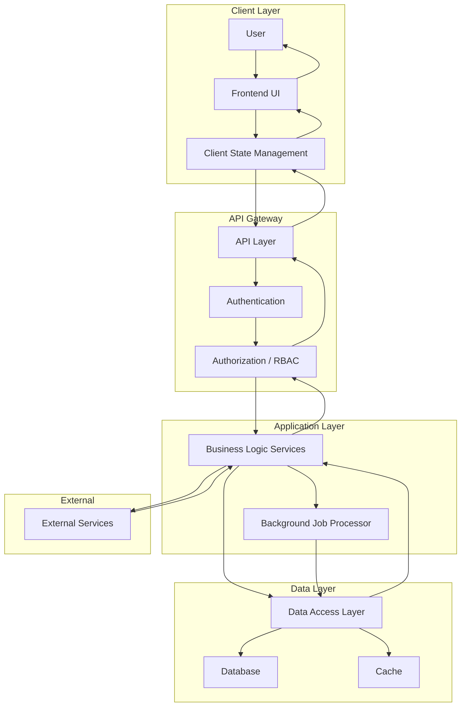

# Detailed System Architecture Diagram

```mermaid
graph TD
    subgraph Client Layer
        A[User]
        B[Frontend UI]
        C[Client State Management]
    end

    subgraph API Gateway
        D[API Layer]
        E[Authentication]
        F[Authorization / RBAC]
    end

    subgraph Application Layer
        G[Business Logic Services]
        H[Background Job Processor]
    end

    subgraph Data Layer
        I[Data Access Layer]
        J[Database]
        K[Cache]
    end

    subgraph External
        L[External Services]
    end

    A --> B
    B --> C
    C --> D
    D --> E
    E --> F
    F --> G
    G --> I
    G --> H
    H --> I
    I --> J
    I --> K
    G --> L
    L --> G
    I --> G
    G --> F
    F --> D
    D --> C
    C --> B
    B --> A
```

---

*Target Architecture v1.0*
