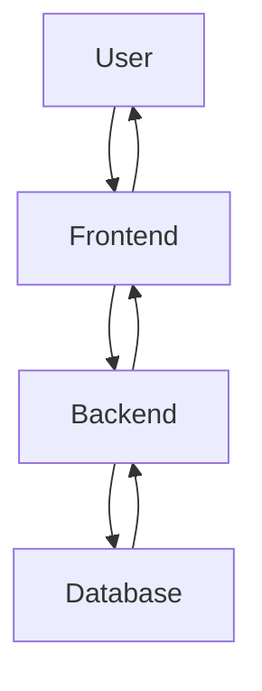

# System Architecture

## High-Level Overview

Lineup is designed as a modern, cloud-based platform that separates concerns between what users see, what processes their requests, and where data is stored.

The system follows a layered architecture where each component has a single responsibility and communicates through well-defined interfaces.

---

## Core Components

### Frontend

The user-facing layer that provides the visual interface.

- Handles all user interactions
- Displays data in a meaningful way
- Sends requests to the backend for processing
- Receives and renders responses

The frontend does not store permanent data. It only displays information retrieved from the backend.

---

### Backend

The processing layer that contains all business logic.

- Receives requests from the frontend
- Validates and processes data
- Applies business rules
- Coordinates with the database
- Returns structured responses

The backend acts as the gatekeeper. It ensures data integrity and enforces access control.

---

### Database

The persistence layer where all information is stored.

- Stores user accounts and permissions
- Maintains candidate and interview records
- Preserves historical data for reporting
- Ensures data is not lost between sessions

The database is only accessed by the backend, never directly by the frontend.

---

## Communication Flow

All interactions follow a predictable request-response pattern:

1. **User Action** — The user performs an action (click, form submission)
2. **Frontend Request** — The frontend sends a structured request to the backend
3. **Backend Processing** — The backend validates the request and applies logic
4. **Database Query** — The backend reads or writes data as needed
5. **Backend Response** — The backend sends a response to the frontend
6. **Frontend Update** — The frontend updates the display for the user

This separation ensures that changes to one layer do not break others.

---

## Design Principles

### Separation of Concerns

Each component handles only its designated responsibility. The frontend does not contain business logic. The backend does not render views.

### Stateless Communication

Each request from frontend to backend is independent. The backend does not remember previous requests. All necessary context is included in each request.

### Single Source of Truth

The database is the authoritative source for all data. The frontend and backend may cache data temporarily, but the database holds the permanent record.

### Security by Design

All requests pass through the backend, which verifies identity and permissions before any action is taken.

---

## System Diagram

---

*Document Version: 1.0*
*Status: Initial Architecture*
