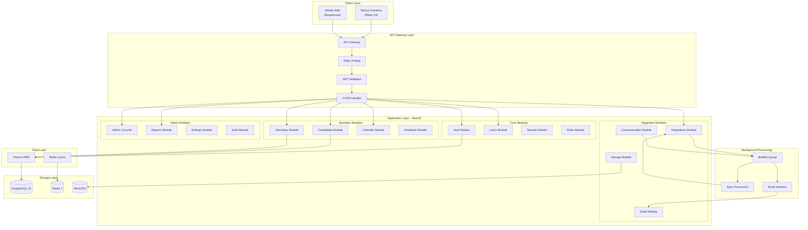
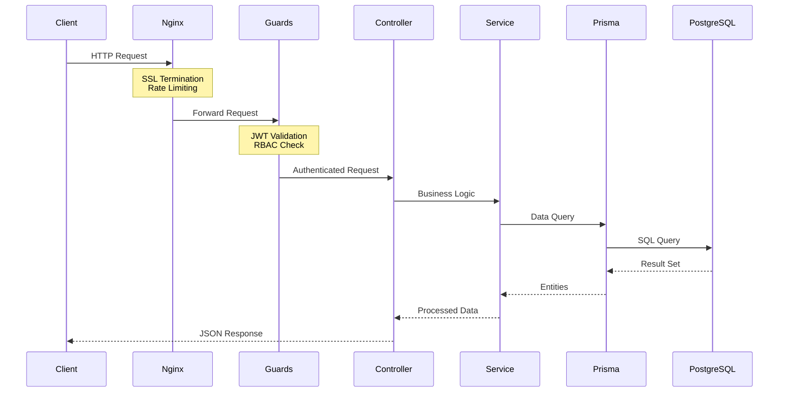
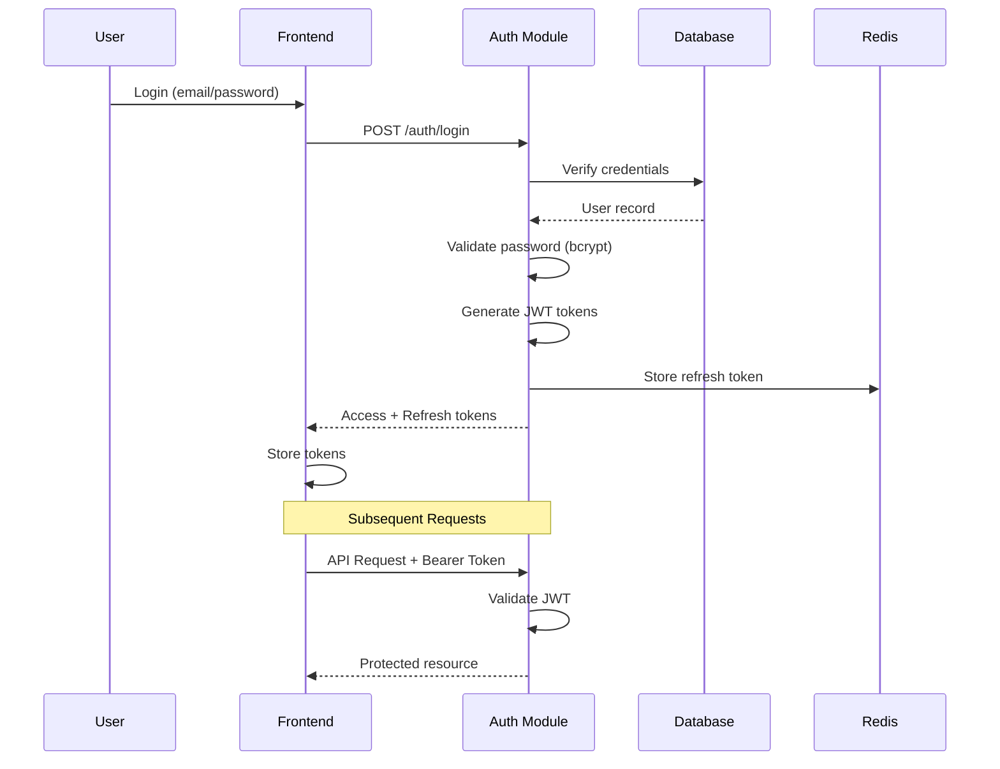
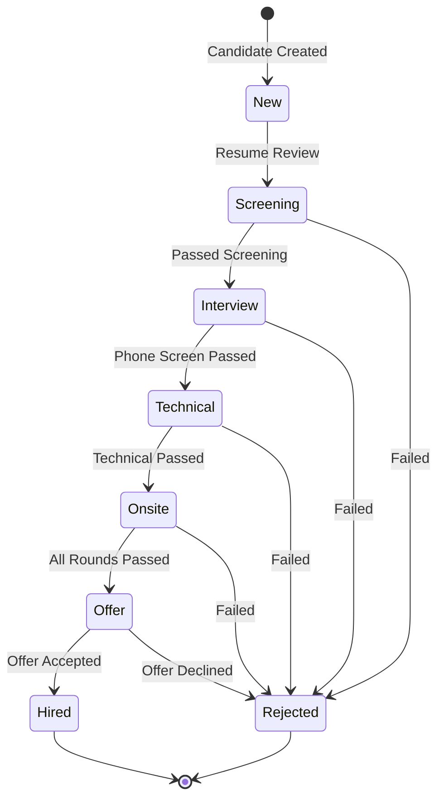
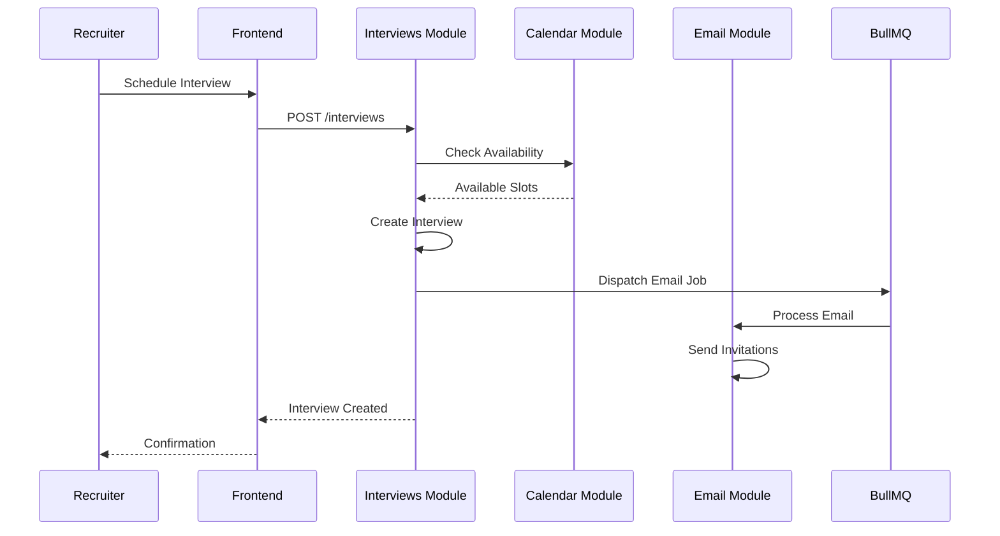
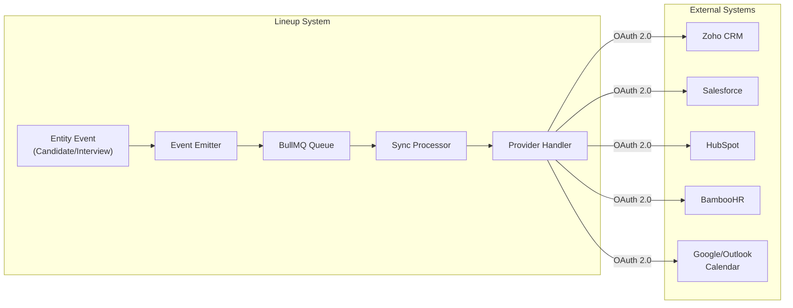
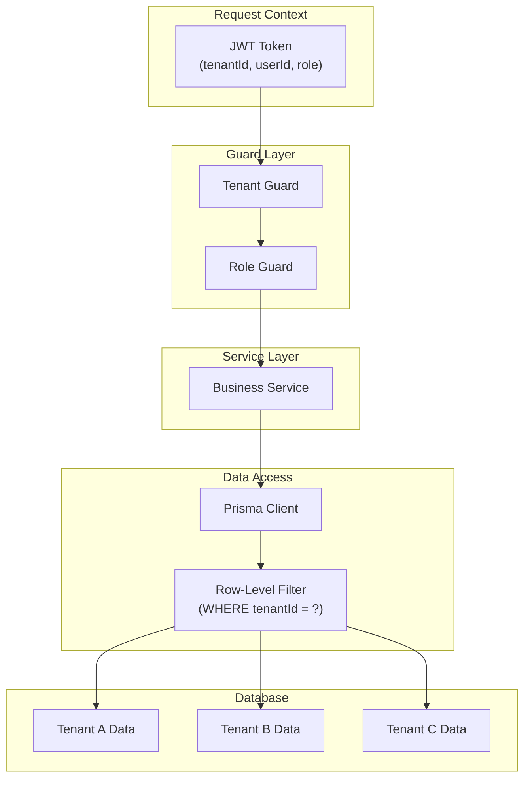
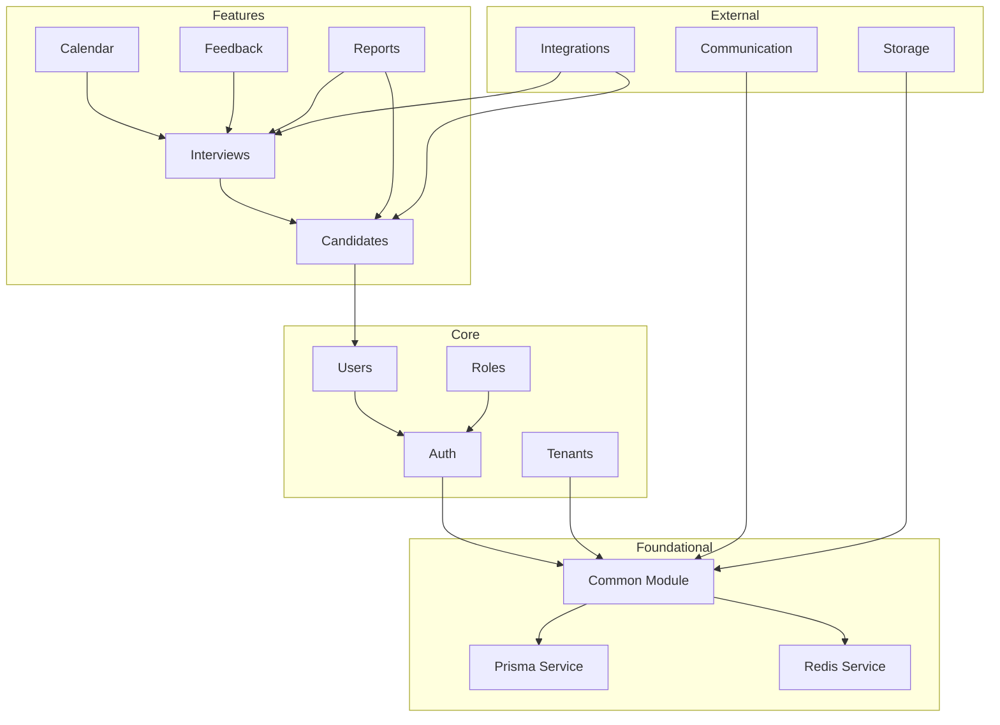

# Lineup - Workflow Architecture UML Diagram

## System Overview

---

## Request Flow Sequence

---

## Authentication Flow

---

## Candidate Workflow

---

## Interview Scheduling Flow

---

## External Integration Flow

---

## Multi-Tenant Data Flow

---

## Module Dependencies

---

## Technology Stack Summary

| Layer | Technology | Purpose |
|-------|------------|---------|
| **Frontend** | Next.js 16, React 19 | UI Framework |
| **Backend** | NestJS 11 | API Server |
| **Database** | PostgreSQL 15 | Primary Data Store |
| **Cache** | Redis 7 | Sessions, Caching |
| **Queue** | BullMQ | Background Jobs |
| **Storage** | MinIO (S3) | File Storage |
| **ORM** | Prisma 5 | Database Access |
